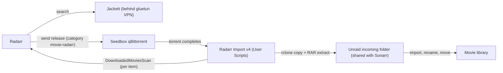

# Radarr Import v4


Pulls completed Radarr downloads from a remote seedbox to Unraid **exactly once**, extracts any RAR archives, and tells Radarr to import them.

This is the Radarr counterpart of **Sonarr Import v4**. It runs as an Unraid **User Scripts** entry (every 10 minutes), and nothing needs to be installed or scripted on the seedbox.

## Table of contents

- [How the pipeline works](#how-the-pipeline-works)
- [Differences from the Sonarr version](#differences-from-the-sonarr-version)
- [Requirements](#requirements)
- [Setup](#setup)
- [Files and state](#files-and-state)
- [Troubleshooting](#troubleshooting)
- [Security notes](#security-notes)

## How the pipeline works



1. **Radarr** finds a wanted movie and searches via **Jackett** (behind a gluetun VPN).
2. Radarr sends the release to the **remote seedbox qBittorrent** with the category `movie-radarr`.
3. qBittorrent downloads it into the seedbox download folder.
4. Every 10 minutes, **this script**:
   1. Logs in to the qBittorrent Web API and lists torrents in the `movie-radarr` category that are 100% complete.
   2. Skips any torrent whose hash is already in the local ledger.
   3. Gets the torrent's exact file list from the API (wanted files only, samples excluded).
   4. Copies only those files from the seedbox to the local `incoming` folder with `rclone copy` (inside the rclone Docker container).
   5. Extracts RAR sets locally, removing archive parts only after confirming media exists.
   6. Records the hash in the ledger so the torrent is never pulled again.
   7. Fixes permissions and triggers a Radarr `DownloadedMoviesScan` for each newly pulled item.
5. **Radarr** imports, renames and moves the movie into the library using its remote path mapping.

## Differences from the Sonarr version

| | Sonarr Import v4 | Radarr Import v4 |
|---|---|---|
| **Category** | `tv-sonarr` | `movie-radarr` |
| **Landing folder** | `incoming` | `incoming` (shared) |
| **Import command** | `DownloadedEpisodesScan` on each newly pulled item | `DownloadedMoviesScan` on each newly pulled item |
| **App URL / port** | `localhost:8989` | `localhost:7878` |
| **Ledger** | `appdata/seedbox-pull/` | `appdata/seedbox-pull-radarr/` |
| **Log** | `SONARR_import.log` | `RADARR_import.log` |
| **Lock file** | `/tmp/seedbox_pull.lock` | `/tmp/seedbox_pull_radarr.lock` |

> [!IMPORTANT]
> **Shared landing folder:** If both scripts download into the same `incoming` folder, each app must only scan the item it just pulled, never the whole folder. Otherwise Sonarr would try to import movies as episodes (and Radarr the reverse). Both scripts therefore send a scan for the exact folder or file that was pulled. If you are upgrading an older Sonarr script that scanned the whole folder, update it to the per-item version. The scripts keep separate ledgers, logs and lock files, so they can run at the same time without interfering.

All other behavior (ledger, `flock`, API-driven pulls, extraction safeguards, log rotation) is identical to the Sonarr version.

## Requirements

### Unraid

- [User Scripts](https://forums.unraid.net/topic/48286-plugin-ca-user-scripts/) plugin
- `jq` (included in recent Unraid releases; otherwise install via NerdTools)
- `unrar` or `7z` for extracting RAR archives
- Docker with an rclone container (this setup uses `binhex-rclone`) that can reach the seedbox
- The local landing folder on a cache-backed share (`/mnt/user/media/incoming`), shared with the Sonarr script and already mapped into the rclone container as `/data/incoming`

### Seedbox

- qBittorrent with the Web UI reachable from Unraid (the same URL Radarr uses); use `https` if available
- An rclone remote (SFTP in this setup) that can read the download folder
- Torrents saved under the folder configured as `REMOTE_ROOT`

### Radarr

- qBittorrent configured as a download client with **Category** set to `movie-radarr`
- The download client's **Tags** field empty (or matching the movie's tags)
- A **Remote Path Mapping** (Settings → Download Clients) from the seedbox download folder to the local folder as the Radarr container sees it, for example `/media/incoming/`
- An API key (Settings → General)

> [!IMPORTANT]
> If the download client has a tag that the movie does not, Radarr reports that no download client was found without tags or a matching tag. Clear the tag on the client, or add it to the movie.

## Setup

1. Make sure the Radarr container can see the shared `incoming` folder (for example as `/media/incoming`), and that the Sonarr script has been updated to per-item scans.
2. In Radarr, set the qBittorrent client's category to `movie-radarr`, leave its Tags empty, and add the Remote Path Mapping.
3. Create a User Scripts entry named `Radarr Import v4` and paste in the script. Fill in the configuration block at the top (qBittorrent URL and login, paths, Radarr API key).
4. If the script was edited on Windows, convert the line endings:

   ```bash
   sed -i 's/\r$//' "/boot/config/plugins/user.scripts/scripts/Radarr Import v4/script"
   ```

5. Wait until Radarr's queue is empty, then run once with `--bootstrap` to mark every currently complete torrent as already handled:

   ```bash
   bash "/boot/config/plugins/user.scripts/scripts/Radarr Import v4/script" --bootstrap
   ```

   > [!WARNING]
   > Skip this step and the first scheduled run will treat every completed `movie-radarr` torrent as new and pull the entire backlog.

6. Run it again without the flag. It should log `Nothing new to pull.`
7. Schedule it with the custom cron `*/10 * * * *`.
8. Test with a single movie and follow the log:

   ```bash
   tail -f /mnt/user/logs/RADARR_import.log
   ```

   Expect `Pulling`, `Done`, then `Radarr scan queued`, and then check Radarr's Activity → History for the import.

## Files and state

| Path | Purpose |
|---|---|
| `/mnt/user/logs/RADARR_import.log` | Log (rotated at 10 MB to `.1`) |
| `/mnt/user/appdata/seedbox-pull-radarr/pulled_hashes.txt` | Ledger of pulled torrent hashes |
| `<incoming>/.pull-lists/` | Temporary per-torrent file lists |

To force a torrent to be pulled again, remove its hash from the ledger. An existing 24h cleanup script for `incoming` covers both apps, since they share the folder.

## Troubleshooting

<details>
<summary><code>invalid option name</code> or <code>$'\r': command not found</code></summary>

The script has Windows line endings. Run the `sed` command from [Setup](#setup) step 4.

</details>

<details>
<summary><code>qBittorrent login failed</code></summary>

Wrong URL, username or password, or the Web UI is not reachable from Unraid.

</details>

<details>
<summary>Nothing is ever pulled</summary>

`QBIT_CATEGORY` does not exactly match the category set in Radarr (it is case-sensitive), or no torrents in that category are complete yet.

</details>

<details>
<summary><code>Skipping '...': save path is outside REMOTE_ROOT</code></summary>

The torrent's save path is not under `REMOTE_ROOT`. Fix the category's save path in qBittorrent or adjust `REMOTE_ROOT`.

</details>

<details>
<summary>rclone fails with a "directory not found" style error on the destination</summary>

`RCLONE_DEST_PATH` does not match the rclone container's mapping of the incoming folder (`/data/incoming`).

</details>

<details>
<summary>Files arrive but Radarr does not import them</summary>

Check that the Radarr container path in the script matches how Radarr sees the folder, that the Remote Path Mapping is correct, and Radarr's System → Logs. A movie that is not in Radarr's library (not added or monitored) will not be imported.

</details>

<details>
<summary>Transfers are slow</summary>

Test a single large file with `rclone copy -P` to see whether the limit is SFTP overhead or the seedbox uplink. Tune with `RCLONE_EXTRA` (for example `--sftp-concurrency`).

</details>

## Security notes

> [!CAUTION]
> The script contains the qBittorrent login and the Radarr API key. Do not share or commit it as is.

- User Scripts live on the Unraid flash drive, which does not enforce file permissions and is included in flash backups.
- Optionally move the secrets to a `chmod 600` file on the array and `source` it from the script.
- Use an `https` qBittorrent URL if the seedbox offers one, so the password is not sent in cleartext.
